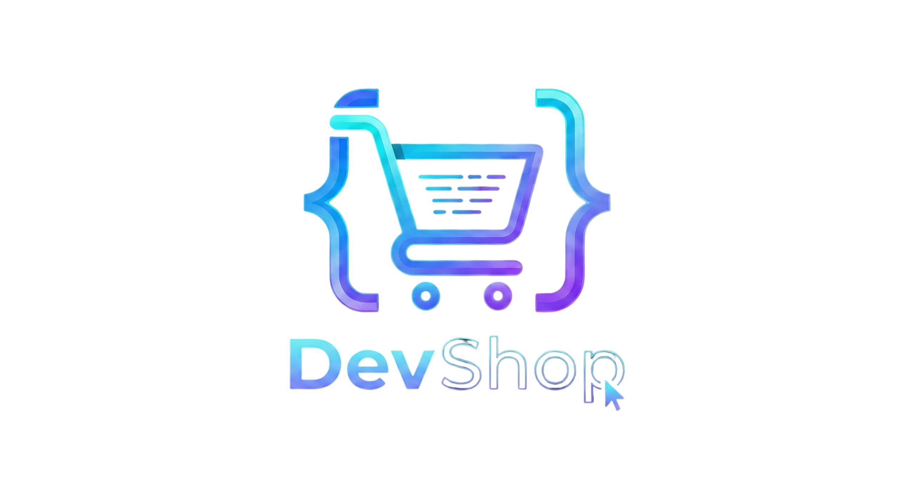

# DevShop - E-Learning Platform

[](https://github.com/Sitthidet-SR/devshop-php)
[](https://www.php.net/)
[](https://www.mysql.com/)
[](LICENSE)

แพลตฟอร์มเรียนรู้การเขียนโปรแกรมออนไลน์ที่ทันสมัย พัฒนาด้วย PHP และ MySQL



> 🎓 แพลตฟอร์มเรียนรู้ออนไลน์ที่ครบครัน พร้อมระบบจัดการคอร์ส ใบประกาศ และระบบชำระเงิน

## ✨ ฟีเจอร์หลัก

### สำหรับผู้เรียน
- 🎓 เรียนคอร์สออนไลน์ได้ทุกที่ทุกเวลา
- � รวิดีโอบทเรียนคุณภาพสูง (รองรับ YouTube, Vimeo, MP4)
- � ติดตามิความคืบหน้าการเรียน
- 🎯 ระบบทำแบบทดสอบและแบบฝึกหัด
- 🏆 ใบประกาศนียบัตรเมื่อเรียนจบ (ดาวน์โหลด PDF ได้)
- ⭐ รีวิวและให้คะแนนคอร์ส
- 🛒 ตะกร้าสินค้าและระบบชำระเงิน
- � รายกาสรโปรด (Wishlist)

### สำหรับผู้สอน
- 📚 สร้างและจัดการคอร์สเรียน
- � เพิ่มบทูเรียนและเนื้อหา
- � ดจัดระเบียบด้วยระบบ Section
- � ตั้งราค้าและจัดการคอร์ส
- 📈 ดูสถิติการขาย

### สำหรับแอดมิน
- 👥 จัดการผู้ใช้งาน
- � จัดกoารคอร์สทั้งหมด
- � รจัดการคำสั่งซื้อ
- � Dิashboard สรุปข้อมูล
- 📧 จัดการข้อความติดต่อ

## �️ เทคโนโลยีที่ใช้

- **Backend:** PHP 7.4+
- **Database:** MySQL 5.7+
- **Frontend:** HTML5, CSS3, JavaScript
- **Libraries:** 
  - TCPDF (สร้าง PDF ใบประกาศ)
  - SweetAlert2 (แจ้งเตือนสวยงาม)
  - Font Awesome (ไอคอน)

## 📋 ความต้องการของระบบ

- PHP 7.4 หรือสูงกว่า
- MySQL 5.7 หรือสูงกว่า
- Apache/Nginx Web Server
- PHP Extensions: mysqli, gd, mbstring, curl

## 🚀 การติดตั้ง

ดูคู่มือการติดตั้งแบบละเอียดใน [INSTALLATION.md](INSTALLATION.md)

### ติดตั้งแบบเร็ว (Linux/Mac)

```bash
# 1. Clone โปรเจค
git clone https://github.com/Sitthidet-SR/devshop-php.git devshop
cd devshop

# 2. Import ฐานข้อมูล
mysql -u root -p < sql/devshop.sql

# 3. ตั้งค่าการเชื่อมต่อฐานข้อมูล
nano includes/config.php

# 4. ตั้งค่า permissions
chmod -R 755 .
chmod -R 777 uploads/

# 5. เปิดเว็บเบราว์เซอร์
# http://localhost/devshop
```

## 👤 บัญชีทดสอบ

### แอดมิน
- Email: `admin@devshop.com`
- Password: `admin123`

### ผู้สอน
- Email: `instructor@devshop.com`
- Password: `instructor123`

### นักเรียน
- Email: `student@devshop.com`
- Password: `student123`

## � โครงอสร้างโปรเจค

```
devshop/
├── admin/              # ระบบจัดการแอดมิน
├── assets/             # ไฟล์ CSS, JS, รูปภาพ
├── includes/           # ไฟล์ PHP ส่วนกลาง
├── sql/                # ไฟล์ฐานข้อมูล
├── uploads/            # ไฟล์อัพโหลด
├── vendor/             # ไลบรารีภายนอก
├── index.php           # หน้าแรก
├── courses.php         # หน้าคอร์สทั้งหมด
├── course_detail.php   # รายละเอียดคอร์ส
├── course_learn.php    # หน้าเรียน
├── certificate.php     # ใบประกาศ
├── my_courses.php      # คอร์สของฉัน
└── ...
```

## 🎨 ฟีเจอร์เด่น

### ระบบใบประกาศนียบัตร
- สร้างใบประกาศอัตโนมัติเมื่อเรียนจบ
- ดาวน์โหลด PDF ได้
- ตรวจสอบความถูกต้องของใบประกาศ
- รองรับภาษาไทยใน PDF

### ระบบชำระเงิน
- ชำระผ่านบัตรเครดิต
- ชำระผ่าน QR Code
- ชำระผ่านโอนเงิน
- ประวัติการสั่งซื้อ

### ระบบวิดีโอ
- รองรับ YouTube
- รองรับ Vimeo
- รองรับไฟล์ MP4
- เล่นวิดีโอได้ภายในเว็บ

## 🔧 การตั้งค่า

### ตั้งค่าอัพโหลดไฟล์ขนาดใหญ่

แก้ไขไฟล์ `php.ini`:
```ini
upload_max_filesize = 100M
post_max_size = 100M
max_execution_time = 300
memory_limit = 256M
```

### ตั้งค่า URL Rewriting

ไฟล์ `.htaccess` มีอยู่แล้ว ตรวจสอบว่า Apache เปิด `mod_rewrite`:
```bash
sudo a2enmod rewrite
sudo systemctl restart apache2
```

## 📝 License

MIT License - ใช้งานได้อย่างอิสระ

## 👨‍💻 ผู้พัฒนา

พัฒนาโดย [Sitthidet-SR](https://github.com/Sitthidet-SR)

## 🤝 การสนับสนุน

หากพบปัญหาหรือต้องการความช่วยเหลือ:
- เปิด Issue บน [GitHub](https://github.com/Sitthidet-SR/devshop-php/issues)
- ติดต่อผ่านหน้าเว็บ Contact Us

## 🎯 Roadmap

- [ ] ระบบแชทสดกับผู้สอน
- [ ] แอปมือถือ (iOS/Android)
- [ ] ระบบ Live Streaming
- [ ] การแจ้งเตือนผ่าน Email
- [ ] ระบบคูปองส่วนลด
- [ ] รองรับหลายภาษา

